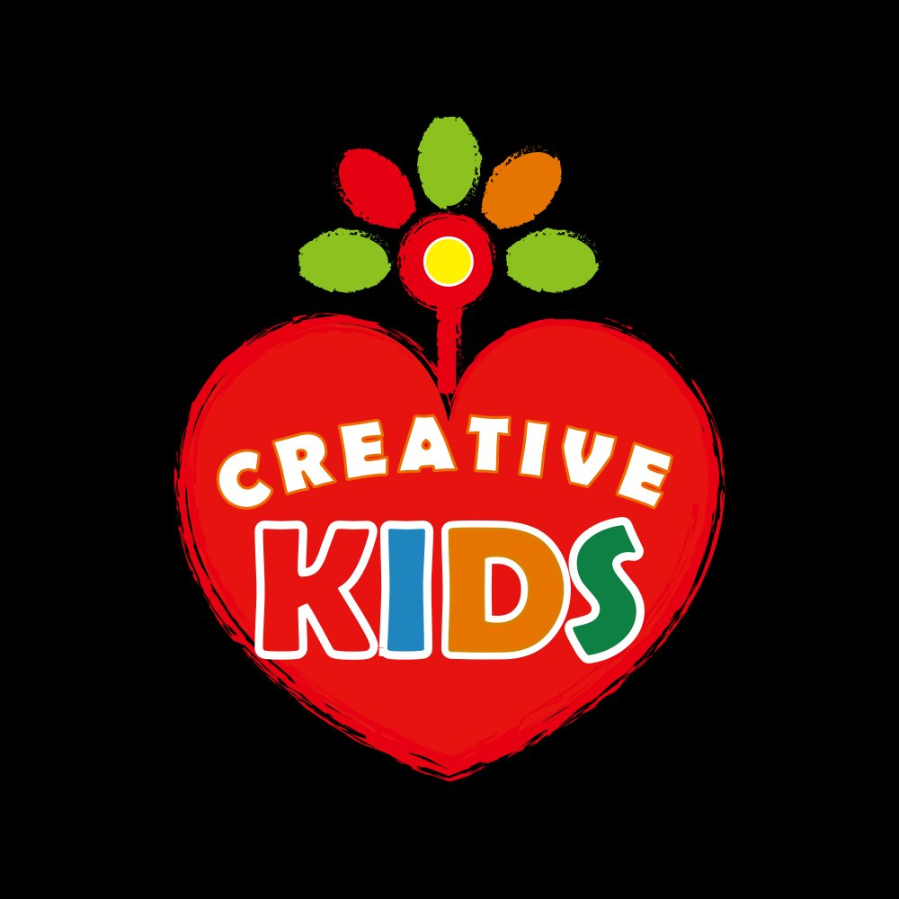

# 🎨 Creative Kids — Official Website

> 子どもの創造性を解放し、エンパワメントする  
> *Liberating and empowering children's creativity since 2019*

[](https://your-username.github.io/creative-kids/)
[](LICENSE)

---

## 📖 プロジェクトについて

**Creative Kids（クリエイティブキッズ）** は、2019年にTAKEBONが立ち上げた、子どもたちの創造性を解放・エンパワメントする活動です。

日本のZ世代で「自分は創造的だ」と答えた割合はわずか **8%**（Adobe調査）。世界の先進国の5倍以上の差があります。Creative Kidsは、この現状を変えるために、学校・企業・クリエイターとの輪を広げながら活動しています。

### 3つのアプローチ

| ステップ | 名称 | 内容 |
|---|---|---|
| 1 | **着火する** (Ignite) | 子どもの内なる「やってみたい」に火をつける |
| 2 | **バイアス外し** (Unbias) | 客観的な視点でそっと後押しし、思考の制限を外す |
| 3 | **変換する** (Transform) | 想いを形に。アイデアを実際の創造物へと変換する伴走 |

---

## 🗂️ ファイル構成

```
creative-kids/
├── index.html      # メインページ（単一HTMLファイル）
├── logoCK.png      # Creative Kidsロゴ
└── README.md       # このファイル
```

外部ライブラリ・ビルドツール不要の **シングルファイル構成** です。

---

## 🚀 GitHub Pages で公開する手順

### 1. リポジトリを作成する

```bash
# GitHubで新しいリポジトリを作成後
git init
git add .
git commit -m "first commit: Creative Kids website"
git remote add origin https://github.com/your-username/creative-kids.git
git push -u origin main
```

### 2. GitHub Pages を有効にする

1. GitHubのリポジトリページを開く
2. **Settings** タブをクリック
3. 左サイドバーの **Pages** を選択
4. **Source** を `Deploy from a branch` に設定
5. **Branch** を `main` / `(root)` に設定して **Save**

数分後、以下のURLでサイトが公開されます：

```
https://takenokodesign.github.io/creative-kids/
```

### 3. ロゴの表示を確認する

`index.html` の `` のパスは、リポジトリの構成によって調整が必要な場合があります。

**リポジトリのルートに置く場合（推奨）：**

```html
<!-- index.html 内のロゴ参照箇所を以下に変更 -->

```

> ファイルを `index.html` と `logoCK.png` を同じフォルダに置けばそのまま動作します。

---

## 🎨 デザインガイド

### コンセプト
- **Apple風のシンプルでクリーンなデザイン**
- 白背景統一、余白を活かしたレイアウト
- スクロールに連動したフェードインアニメーション

### カラーパレット

| 色 | 用途 | HEX |
|---|---|---|
| 🔴 レッド | メインカラー、強調 | `#E8221A` |
| 🟢 グリーン | アクセント | `#4CAF50` |
| 🔵 ブルー | アクセント | `#2196F3` |
| 🟠 オレンジ | アクセント | `#FF9800` |
| ⬛ ダーク | テキスト・黒背景セクション | `#1d1d1f` |
| ⬜ ライトグレー | セクション背景 | `#f5f5f7` |

### タイポグラフィ

| フォント | 用途 |
|---|---|
| Outfit | 英数字・見出し・ロゴ |
| Noto Sans JP | 日本語本文 |
| Noto Serif JP | 引用・強調 |

### ページ構成

```
Hero           → ブランドの世界観を伝える
Stats Strip    → 7年・2000人・8%・∞ の数字で訴求
Philosophy     → Vision / Mission / Value
The Challenge  → Adobe調査データ（8%）の視覚化
Bias           → 3つのバイアスの解説
Process        → 3ステップアプローチ
Promise        → クリエイティブキッズの約束
Activities     → 活動タイムライン（2019〜2025）
About          → TAKEBONプロフィール
Contact        → お問い合わせ
```

---

## 🛠 技術仕様

- **HTML / CSS / Vanilla JS** のみ（フレームワーク不使用）
- **外部依存なし**（Google Fontsのみ読み込み）
- **レスポンシブ対応**（モバイル・タブレット・デスクトップ）
- **IntersectionObserver API** によるスクロールアニメーション
- **CSS Backdrop Filter** によるナビゲーションの毛ガラス効果

---

## 📝 コンテンツ参照元

- [note マガジン「クリエイティブキッズ」](https://note.com/takebonstudio/m/mb3a718fb0570)
- [DesignShip2025 登壇記事](https://note.com/takebonstudio/n/n436a8ba58589)
- [TAKEBONSTUDIO ブログ](https://takebonstudio.jimdoweb.com)

---

## 👤 Author

**TAKEBON** (竹中 俊仁)  
UXデザイン / マーケティング / プロダクトデザイン / 人間中心設計専門家

- note: [@takebonstudio](https://note.com/takebonstudio)
- site: [takebonstudio.jimdoweb.com](https://takebonstudio.jimdoweb.com)

---

## 📄 ライセンス

このプロジェクトは [MIT License](LICENSE) のもとで公開されています。  
ロゴ・ブランドアセットの無断転用はご遠慮ください。

---

*Creative Kids — 子どもの創造性は蓋をされているだけ。*
